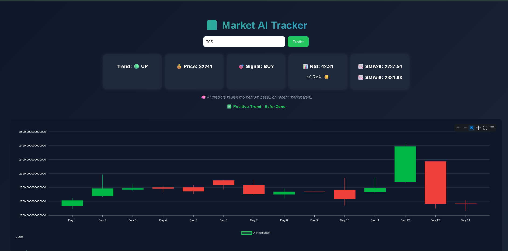

# 📊 Market AI Tracker

An AI-powered stock market prediction dashboard built with **React (frontend)** and **Flask (backend)**.  
This project combines **technical indicators (RSI, SMA20, SMA50)** with **AI predictions** to provide professional trading insights.

---

## 🚀 Features
- 📈 **Candlestick Chart** with SMA20 & SMA50 overlays
- 🤖 **AI Prediction Line Chart** with confidence levels
- 🔔 Buy/Sell signals with alerts
- 🎨 Modern UI with gradient theme and responsive design
- 🌐 Deployed on **Vercel (frontend)** and **Render (backend)**

---

## 🛠️ Tech Stack
- **Frontend:** React.js, Chart.js, ApexCharts, CSS3
- **Backend:** Flask, yFinance, scikit-learn
- **Deployment:** Vercel (UI), Render (API)
- **Version Control:** GitHub

---

## 📷 Screenshots
(Add screenshots of your dashboard here)

---

## 🔗 Live Demo
- **Frontend (Dashboard):** [Vercel Link](https://your-vercel-link.vercel.app)  
- **Backend (API):** [Render Link](https://your-render-link.onrender.com)  
- **Source Code:** [GitHub Repo](https://github.com/YourUsername/Market-AI-Tracker)

---

# ⚙️ Installation & Setup

# 1. Clone the repository
```bash
git clone https://github.com/YourUsername/Market-AI-Tracker.git
cd Market-AI-Tracker

----

## 📷 Screenshots

Here’s a preview of the Market AI Tracker dashboard:



---

## 👨‍💻 Author

**Ragul G**  
B.Tech AI & Data Science, RVS Technical Campus, Coimbatore  
💡 Interests: AI, ML, Data Science, Web Development  
📫 Contact: ragul45678@gmail.com

---

## 📜 License
This project is licensed under the Apache 2.0 License.
 
---