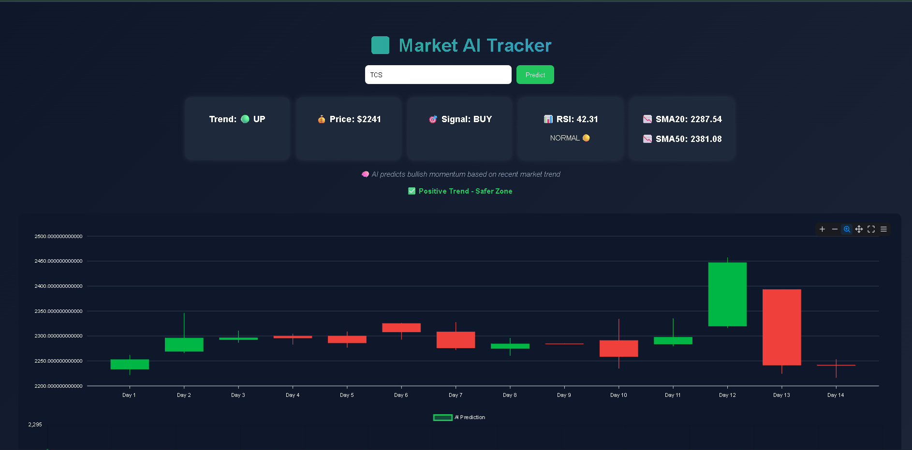

# Market AI Tracker

**AI-powered stock market analytics platform** — advanced technical analysis, explainable ML forecasting, buy/sell/hold signals, news sentiment, multi-stock comparison and portfolio tracking.

> **AI-generated market analysis for informational purposes only. Not financial advice.**



---

## Features

- 🔍 **Advanced stock search** — debounced autocomplete by company name / ticker / symbol, recent + popular picks, curated Indian (`.NS`/`.BO`), US, ETF, gold and index lists
- 🇮🇳 **Indian markets** — NSE/BSE stocks, ETFs, gold instruments, NIFTY / BANKNIFTY / SENSEX where the provider supports them
- 🌎 **Global markets** — major US stocks & ETFs via the same data provider; invalid symbols get a clear, honest error (never faked data)
- 📊 **Technical indicators** — RSI, SMA 20/50/200, EMA 20/50/200, MACD (+signal/histogram), Bollinger Bands, ATR, Stochastic, OBV, volume average, support/resistance, annualized volatility
- 📈 **Professional charts** — candlestick / line / area, toggleable overlays, separate RSI / MACD / volume panels, ranges 1D→5Y, zoom & pan (ApexCharts), forecast chart with 95% band (Chart.js)
- 🤖 **Explainable ML forecasting** — Linear Regression vs Random Forest vs Gradient Boosting with **purged time-series cross-validation**; real MAE / RMSE / MAPE / directional accuracy, naive baseline and skill ratio reported honestly
- 🎯 **Defensible uncertainty** — 95% prediction interval from out-of-fold residual σ; model confidence is a documented composite score, **not** a probability
- 🔔 **Explainable BUY / SELL / HOLD signals** — rule-based with ✓ supporting and ⚠ conflicting factors
- 📰 **News + sentiment** — real Yahoo Finance headlines, transparent lexicon scoring, clean "unavailable" state
- 📊 **Multi-stock comparison** — up to 6 instruments across price, technicals, forecast and signal
- 💼 **Portfolio tracking** — quantity + buy price → investment, value, P/L, allocation (localStorage only; no credentials)
- 📱 **Responsive design** — desktop, laptop, tablet, mobile; toast errors, loading skeletons, accessible markup

## Architecture

```
market ai traker/
├── backend/                 # Flask REST API (deployed on Render)
│   ├── app.py               # routes + error handling (legacy /predict kept)
│   ├── config.py            # env vars, symbol aliases, curated watchlists
│   ├── services/
│   │   ├── market_data.py   # yfinance access + TTL cache + overview
│   │   ├── indicators.py    # ta/pandas indicator computation
│   │   ├── ml.py            # features, purged TSCV, models, uncertainty
│   │   ├── signals.py       # explainable rule-based signal
│   │   ├── news.py          # real headlines + lexicon sentiment
│   │   └── search.py        # curated + Yahoo symbol search
│   └── requirements.txt
└── frontend/                # React SPA (deployed on Vercel)
    └── src/
        ├── App.js           # shell: nav, search, routing
        ├── components/      # charts, overview, signal, news, tables…
        ├── pages/           # Dashboard, Markets, Compare, Portfolio…
        ├── services/api.js  # single Axios layer + errors + cache
        └── hooks/           # useDebounce, useLocalStorage
```

**Data flow:** UI → Axios service layer → Flask (cache) → Yahoo Finance (yfinance) → indicators/ML/signals computed server-side → JSON → charts/components.

## Tech stack

| Layer | Technologies |
|---|---|
| Frontend | React 19, ApexCharts, Chart.js, Axios, CRA |
| Backend | Flask, flask-cors, gunicorn |
| Data | yfinance (Yahoo Finance, delayed quotes) |
| ML/Data | scikit-learn, pandas, numpy, `ta` |
| Deploy | Vercel (frontend), Render (backend) |

## AI/ML methodology

1. **Task** — forecast total return over the next *h* trading days (default 14) from features computed only with data up to day *t*.
2. **Features (18)** — lagged returns (1/5/10/20d), rolling mean/volatility, RSI-14 + delta, MACD histogram + delta, distance from SMA20/SMA50/EMA20, volume z-score, 20d range position, ATR%, day-of-week.
3. **Models** — Linear Regression (baseline), Random Forest (150 trees, depth 6), Gradient Boosting (120 estimators, lr 0.05). Selected by lowest validation MAE.
4. **Validation** — `TimeSeriesSplit(5)`, expanding window, **no shuffling**, with a purged gap of *h* rows so overlapping forward-return windows cannot leak across folds. A naive "0% change" baseline is reported alongside.
5. **Metrics** — MAE / RMSE (price units), MAPE (%), directional accuracy (%), residual σ, plus `skill_vs_naive_mae` (naive MAE ÷ model MAE; < 1 means the model does **not** beat no-change and is labelled accordingly).

### Technical indicators
RSI(14), SMA 20/50/200, EMA 20/50/200, MACD(12,26,9), Bollinger(20,2), ATR(14), Stochastic %K/%D(14,3), OBV, volume SMA20, rolling support/resistance (20/60d), annualized volatility (20d).

### Confidence & uncertainty
- **Uncertainty** = point forecast ± 1.96 × σ, where σ is the std of purged out-of-fold residuals (widened with √time for intermediate days) → a 95% prediction interval.
- **Model confidence (0–100)** = `100 × (0.40·dir + 0.35·mape + 0.25·interval)` with each component clipped to [0,1] from time-series validation. It is a transparent composite score — **not** a probability of profit. The formula is returned in every `/predict` response.

## Installation

**Backend** (Python 3.10+):
```bash
cd backend
python -m venv .venv && source .venv/bin/activate    # Windows: .venv\Scripts\activate
pip install -r requirements.txt
python app.py                                        # http://localhost:10000
```

**Frontend** (Node 18+):
```bash
cd frontend
npm install
npm start          # dev server on :3000
npm run build      # production build
npm test           # unit tests
```

## Environment variables

| File | Variable | Purpose |
|---|---|---|
| `frontend/.env` | `REACT_APP_API_URL` | Backend base URL |
| `frontend/.env` | `REACT_APP_AUTH0_DOMAIN` | Auth0 tenant domain |
| `frontend/.env` | `REACT_APP_AUTH0_CLIENT_ID` | Public Auth0 SPA client ID |
| `frontend/.env` | `REACT_APP_AUTH0_AUDIENCE` | Auth0 API audience |
| `backend/.env` | `PORT` | Server port (default 10000) |
| `backend/.env` | `AUTH0_ISSUER` | Auth0 token issuer |
| `backend/.env` | `AUTH0_AUDIENCE` | Auth0 API audience |
| `backend/.env` | `AUTH0_JWKS_URL` | Auth0 public signing-key endpoint |
| `backend/.env` | `CORS_ORIGINS` | Exact comma-separated allowed origins |
| `backend/.env` | `CACHE_TTL_*` | Cache lifetimes (history/overview/predict) |

The SPA client ID and Auth0 issuer/audience/JWKS URL are public configuration, not secrets. No Auth0 client secret is used. Never commit `.env` files — `.gitignore` covers them.

## API documentation

| Method | Route | Description |
|---|---|---|
| GET | `/` · `/health` | Health checks |
| GET | `/search?q=` | Symbol search (curated + Yahoo) |
| GET | `/watchlists` | Curated quick-pick lists |
| GET | `/quote/<symbol>` · `/quote-summary/<symbol>` | Quote and dashboard summary |
| GET | `/stock/<symbol>` | Overview + indicators + signal |
| GET | `/history/<symbol>?range=` | OHLCV (`1d,5d,1mo,3mo,6mo,1y,2y,5y`) |
| GET | `/indicators/<symbol>?range=` | Indicator values + aligned series |
| GET | `/predict/<symbol>?days=` | Forecast, metrics, uncertainty |
| GET | `/signal/<symbol>` | Explainable signal |
| GET | `/news/<symbol>` · `/news?q=` | Headlines + sentiment |
| GET | `/compare?symbols=A,B` | Comparison snapshot (2–6 symbols) |
| GET | `/predict?ticker=` | **Legacy** endpoint (kept for compatibility) |

Errors are JSON: `{ "error": "human-readable message" }` with proper HTTP status (400/404/502).
`/health` and the legacy `/` health text are public. Tracker data routes require an Auth0 RS256 access token in the `Authorization: Bearer` header; invalid or missing tokens receive 401.

## Deployment

- **Frontend → Vercel**: build command `npm run build`, output `build`; set `REACT_APP_API_URL`, `REACT_APP_AUTH0_DOMAIN`, `REACT_APP_AUTH0_CLIENT_ID`, and `REACT_APP_AUTH0_AUDIENCE` in the Vercel environment settings.
- **Backend → Render**: start command `gunicorn app:app` (root directory `backend/`); set `AUTH0_ISSUER`, `AUTH0_AUDIENCE`, `AUTH0_JWKS_URL`, and `CORS_ORIGINS` to the exact production Vercel origin plus required localhost origins.
- Configure values in the dashboards; keep `.env` files out of git.

## Limitations

- Market data is **delayed**, from Yahoo Finance; no real-time or tick data.
- Model forecasts are statistical estimates — short-horizon equity returns are inherently noisy; metrics are reported honestly and may show the model does not beat the naive baseline.
- News sentiment is keyword-lexicon based (labelled as such), not a trained transformer model.
- Portfolio, recent searches, and comparison symbols remain browser-local; authentication establishes identity but this phase adds no server-side user-data storage or database migration.
- Provider rate limits may slow requests; responses are cached (30 min forecasts, 5 min history, 60 s quotes).

## Disclaimer

This is an analytics and educational project. Nothing here is financial advice, a recommendation, or a guarantee of returns. Predictions, signals, confidence scores and sentiment labels are informational outputs of statistical models and rule systems.

## Future enhancements

- Auth + cloud portfolio sync, price alerts, watchlist trends
- Walk-forward model retraining schedules and optional XGBoost/LightGBM
- Additional news providers and an NLP sentiment model
- PWA/offline caching, i18n, INR/USD display toggle

## Screenshots

The image at the top shows the interface style. After deploying the upgrade, capture the Dashboard, Compare, Portfolio and Analytics pages here.

## Author

**Ragul G**
B.Tech Artificial Intelligence & Data Science
RVS Institute of Technology, Coimbatore
Expected Graduation: 2027

